# **Lucky Bar NFT - Menu of Surprise!**
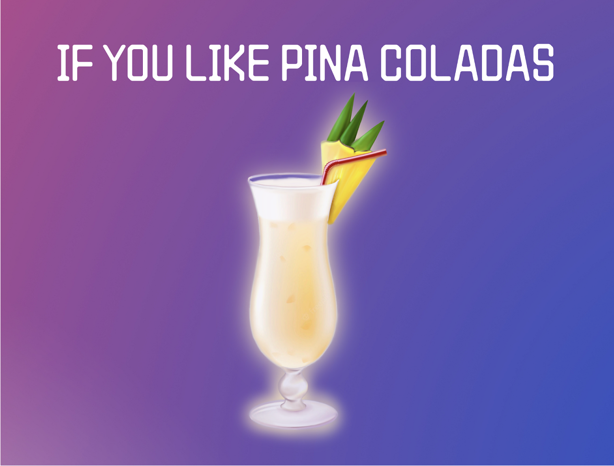

## Overview

LuckyBar is a software company which offers NFT raffle tickets to the restaurant owners in a Software-as-a-Service busines model. It offers its NFT based raffle tickets to restaurant marketplace. The restaurant business owners can further target fancy NFT raffle tickets to their customers. Each raffle ticket may have some menu items in surprise along with the main purchase order at restaurants. It is a unique way of providing dining experience to customers who may not just enjoy additional restaurant menu items in surprise but also own NFT collections!

The proof of concept of LuckyBar prototype can be seen here.

- [Lucky Bar](https://fair.xyz/collection/luckybar)

**LuckyBar Logo**

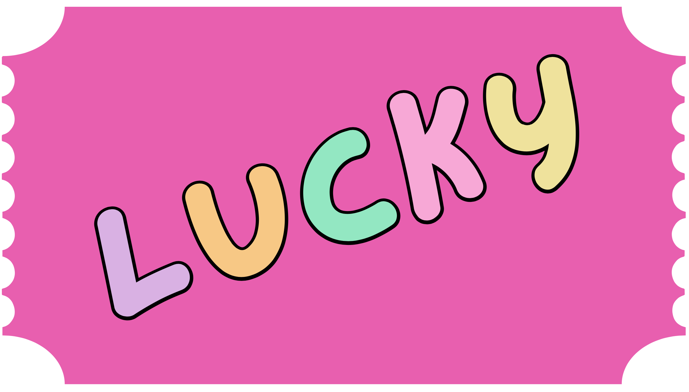


**LuckyBar Potential NFT Rewards**


___

**Required Tools:**

The Solidity program is compiled and deployed over the Ethereum blockchain based sandbox environments called 'Remix VM (London)' and 'Injected Provider - MetaMask', which was previously called as Javascript VM. It will simulate the blockchain transactions defined in the smart contract.

Use the following tools to compile and deploy the program to test.

* [Remix Ethereum IDE](https://remix-project.org/) - Remix IDE, is a no-setup tool with a GUI for developing smart contracts.
* [Ethereum Unit Converter](https://eth-converter.com/) - Ether to Wei unit convertor.
* [Ganache](https://trufflesuite.com/ganache/) - Quickly fire up a personal Ethereum blockchain which you can use to run tests, execute commands, and inspect state while controlling how the chain operates.
* [MetaMask](https://metamask.io/) - A crypto wallet & gateway to blockchain apps.
* [streamlit](https://pypi.org/project/streamlit/) - An all python, free, open source module that enables rapid transformation of data scripts into shareable web apps.
* [Jupyter Notebook](https://jupyter.org/) - To run AI LuckyBar program to interact with OpenAI service endpoint.

**Dependencies**

The project leverages Python version 3.9.13 packaged by conda-forge | (main, May 27 2022, 17:01:00) with Solidity and the following packages to compile, run and test the decentralized application (dApp):

* [sys](https://docs.python.org/3/library/sys.html) - module provides access to some variables used or maintained by the interpreter and to functions that interact strongly with the interpreter.

* [os](https://docs.python.org/3/library/os.html) - module provides a portable way of using operating system dependent functionality.

* [pandas](https://pandas.pydata.org/docs/) - Software library written for the python programming language for data manipulation and analysis.

* [Path](https://pandas.pydata.org/docs/reference/api/pandas.concat.html) - from pathlib - Object-oriented filesystem paths, Path instantiates a concrete path for the platform the code is running on.

* [getenv](https://docs.python.org/3/library/os.html?highlight=os%20getenv#os.getenv) - From 'os', return the value of the environment variable key if it exists, or default if it doesn’t.

* [dotenv](https://pypi.org/project/python-dotenv/) - Python-dotenv reads key-value pairs from a .env file and can set them as environment variables.

* [csv](https://docs.python.org/3/library/csv.html) - a module implements classes to read and write tabular data in CSV format.

* [writer](https://docs.python.org/3/library/csv.html) - from csv, a writer object responsible for converting the user’s data into delimited strings on the given file-like object.

* [json](https://docs.python.org/3/library/json.html#module-json) - JSON (JavaScript Object Notation) is a lightweight data interchange format inspired by JavaScript object literal syntax; exposes an API familiar to users of the standard library marshal and pickle modules.

* [Web3](https://web3py.readthedocs.io/en/v5/quickstart.html) - a collection of modules which contain specific functionality for the ethereum ecosystem.

* [Requests](https://pypi.org/project/requests/) - a simple module/HTTP library which allows transmission of HTTP requests using Python; returns a Response Object with complete response data (content, encoding, status, etc).

* [time](https://docs.python.org/3/library/time.html) - a module provides various time-related functions.

* [Random](https://docs.python.org/3/library/random.html) - a module in Python defines a series of functions for generating or manipulating random integers. Python random() is a pseudo-random number generator function that generates a random float number between 0.0 and 1.0, is used by functions in the random module.

* [Fair.xyz](https://fair.xyz/) - a platform which provides complete blockchain contracting, NFT collection homepage, minting integration, on-chain deployment, pre-sale access, metadata generation, marketplace royalties, reveal experience and allowlists.

**References:**

* [Ethereum Smart Contract](https://ethereum.org/en/smart-contracts/) - A "smart contract" is simply a program that runs on the Ethereum blockchain. It's a collection of code (its functions) and data (its state) that resides at a specific address on the Ethereum blockchain.
* [ERC721](https://eips.ethereum.org/EIPS/eip-721) - The ERC-721 is a standard for representing ownership of non-fungible tokens.
* [OpenZeppelin](https://docs.openzeppelin.com/contracts/2.x/api/token/erc721) - This set of interfaces, contracts, and utilities are all related to the ERC721 Non-Fungible Token Standard.
* [OpenAI API](https://platform.openai.com/docs/introduction) - The OpenAI API can be applied to virtually any task that involves understanding or generating natural language or code.

---
## **Application Usage Guide**

The project has tow major components: AI LuckyBar and LuckyBar.
- 'AI LuckyBar' is used to generate conversational experience to the customers when placing of the menu orders. Likewise, it is used by the restuarnat owner to generate NFT Artworks based on season and other promotional events.
- 'LuckyBar' is used to register the NFT and allow customers to purchase NFTs.

## **Usage of AI Lucky Bar - OpenAI Dall-E**

Currently, the code for ai_nft_maker.ipynb runs locally on a JupyterLab Notebook. Press run all cells, and when getting to the user prompts, just type a response and press enter. The AI generated images get exported to the nft_stores.csv repository.

These are the user prompts to provide hints: 

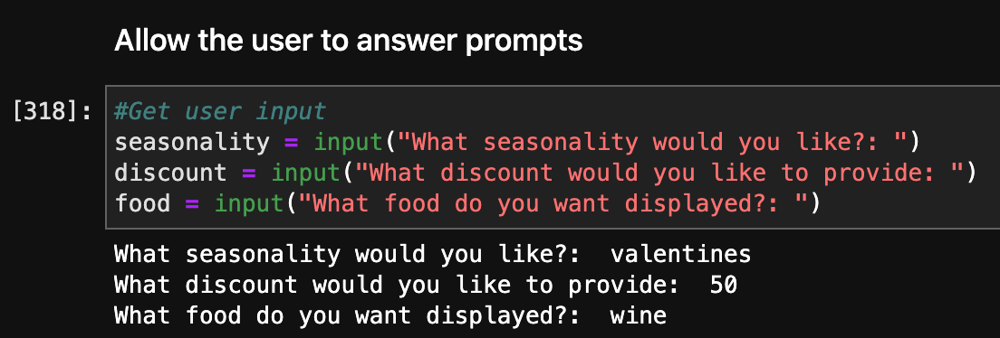

After answering the prompts, the AI generated image will be stored in the nft_stores.csv file in the same folder.

One sample of such AI generated digital artwork:


***Note:*** “OpenAI retains ownership of the original image primarily so that we can better enforce our content policy.” However in OpenAI beta version, we can assume restaurant owners will be able to buy ownership of the NFTs they create.

---
## **Usage of AI Lucky Bar - OpenAI DaVinci-002**

Currently, Streamlit code can only run locally due to API free tier limitations. To initialize the Streamlit, once having navigated to the folder ai_luckybar, run in the terminal: 

```python
streamlit run ai_bartender.py
```

|Scenario: Restaurant customers can press a button to get an NFT from the restaurant's nft_stores.csv.|
|:-:|
|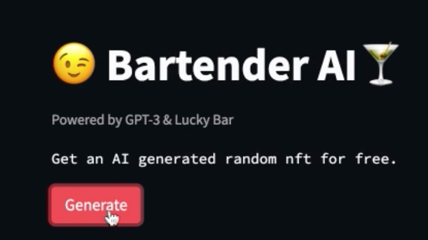|

---

|Scenario: OpenAI generated NFT image|
|:-:|
|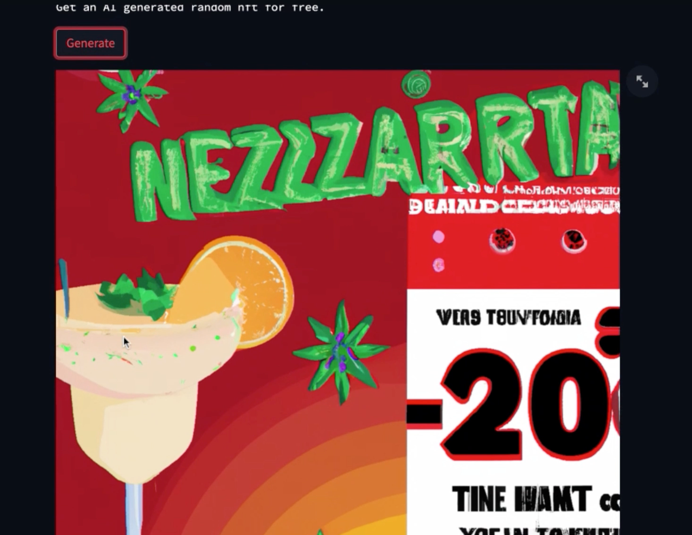|

---

|Scenario: Then, the customer can chat with the AI and get a funny response. To make an order, the user inputs in the textbox as shown below.|
|:-:|
|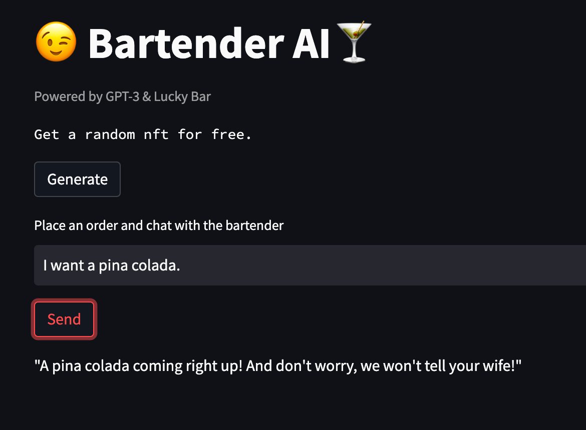|

---
## **Usage of LuckyBar**

To use the smart contract, follow the key steps described as below:

- Clone the repository and load ***artwork.sol*** in Remix IDE. You may see the web console view as:

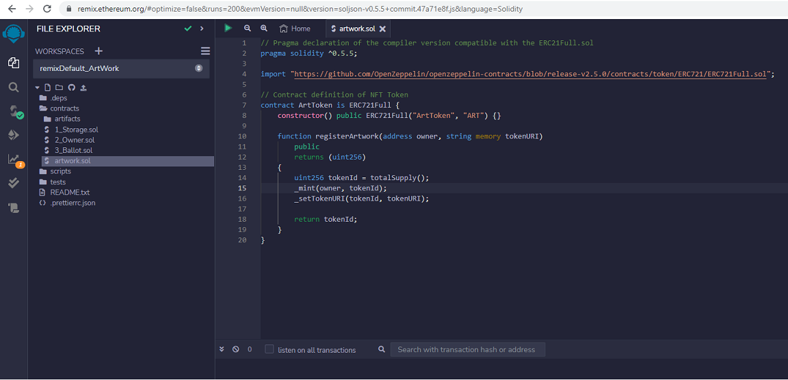

- While deploying, select Remix VM (London) as a sandbox environment.

- You may compile and deploy the smart contract to use it further.

- In order to integrate Remix IDE with MetaMask and MetaMask with Ganache, you may an article [here](https://www.geeksforgeeks.org/how-to-set-up-ganche-with-metamask/).

- Choose 'Injected Provider - MetaMask' as a sandbox blockchain Environment to connect Remix IDE with MetaMask.
- Make sure to import at least two accounts in MetaMask by connecting it to Ganache local network. You may simulate one account address for seller and other for buyer respectively.

- LuckyBar has two main Python files: ***register.py*** and ***lucky.py***. From the Git Bash, run 'streamlit run register.py' to launch the web page of NFT Registration on Streamlit. Likewise, run 'streamlit run lucky.py' to launch the web page of NFT Purchase on Streamlit.


***Note:*** You may need to update 'SAMPLE.env' for Ganache local host URL and artwork.sol contract address to connect Remix IDE, Streamlit, MetaMask and Ganache instances.

___

## Evaluation Evidence: ArtToken Minting, Deployment, Register, Approve and Transfer

**Note:** Take note of 'At Address' field values when deploying the contract *.sol files.

|Scenario: Contract Deployment|
|:-:|
|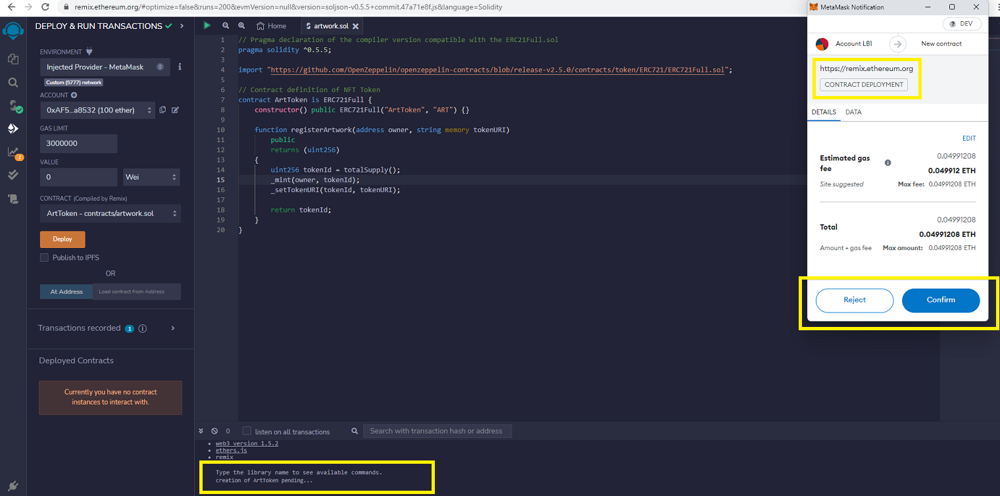|

---

|Scenario: Ganache Contract Mined|
|:-:|
|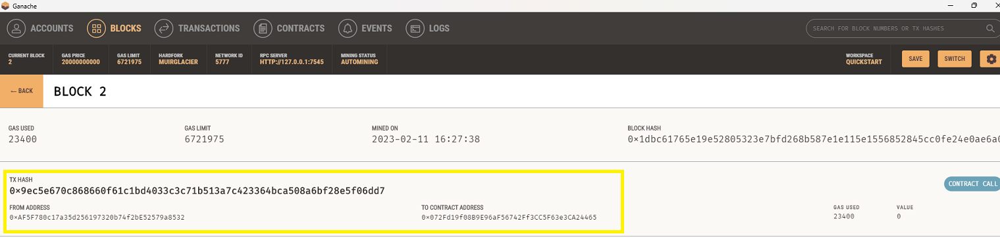|

---

|Scenario: Register Token|
|:-:|
||

---

|Scenario: Token Approve|
|:-:|
|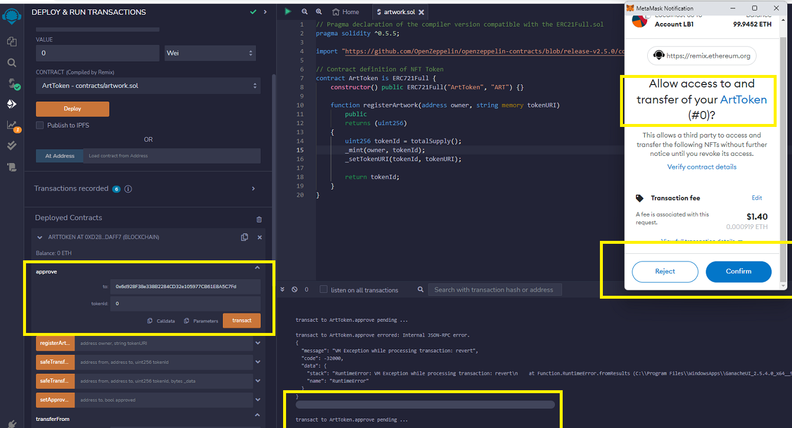|

---

|Scenario: Token Transfer|
|:-:|
|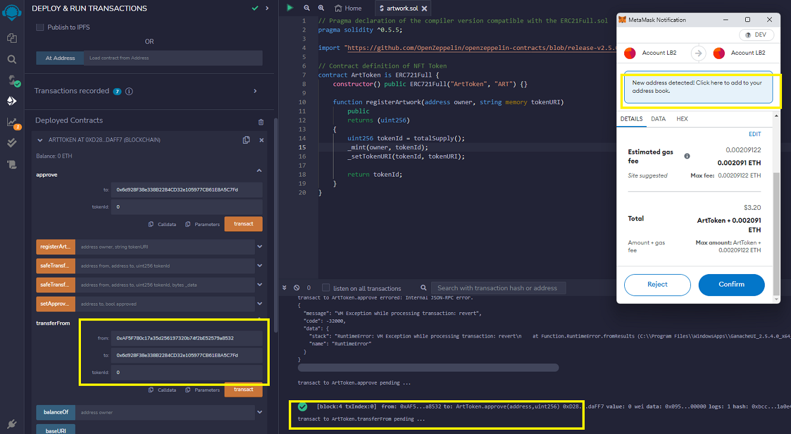|

---

|Scenario: Purchased Token|
|:-:|
|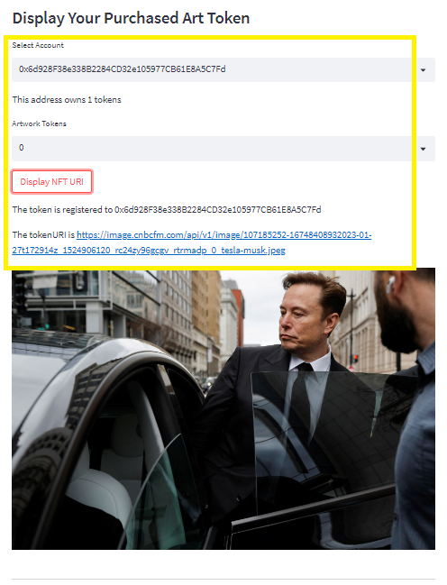|

---

***Note***: The 'artwork' contract ABI specification can be referenced from [here](LuckyBar/contracts/compiled/artwork_abi.json).
___

# **Columbia Engineering FinTech Boot Camp - August 2022 Cohort Capstone** 
### **Contributors**

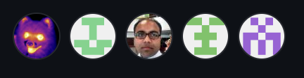

- Loki 'billie' Skylizard
    [LinkedIn](https://www.linkedin.com/in/l-s-6a0316244)
    [@GitHub](https://github.com/Billie-LS)

- Alexandra Paiz
    [LinkedIn](https://www.linkedin.com/in/alexandra-paiz-5b28b6241/)
    [@GitHub](https://github.com/alexandrapaiz)

- Dinesh Mandal
    [LinkedIn](https://www.linkedin.com/in/dineshmandal/)
    [@GitHub](https://github.com/dinesh-m)

- Galiya Khusniyarova
    [LinkedIn](https://www.linkedin.com/in/galiya-khusniyarova-3470a6110/)
    [@GitHub](https://github.com/galiyaKhusniyarova)

- Brock Denton
    [LinkedIn](https://www.linkedin.com/in/brock-denton-7850221a7/)
    [@GitHub](https://github.com/Brock-Denton)

___

### **BootCamp Lead Instructor**

- Vinicio De Sola
    [LinkedIn](https://www.linkedin.com/in/vinicio-desola-jr86/)
    [@GitHub](https://github.com/penpen86)

### **BootCamp Teaching Assistant**

- Santiago Pedemonte
    [LinkedIn](https://www.linkedin.com/in/s-pedemonte/)
    [@GitHub](https://github.com/Santiago-Pedemonte)
___

### **Additional References**

- [opensea](https://opensea.io/collection/flyfish-club/activity)  Flyfish Club (FFC) private dining club; membership is purchased as a Non-Fungible-Token (NFT) to gain access to our restaurant.

- [typing](https://docs.python.org/3/library/typing.html)  Support for type hints.

### **Disclaimer**

[Open AI Generated Images and NFT URIs](https://www.findlaw.com/legalblogs/legally-weird/who-owns-dall-e-images/) - Refer to the article here to understand the ownership of digital images. For the purpose of project idea and demonstration, OpenAI has been used to generate NFT URIs. Such URIs are expiring in nature, thus making it less feasible for any commercial use. The ownership of such digital artworks may be subject to the contract bindings and usage provision of intellectual property as mandated by OpenAI itself.

___

## **License**

MIT License

Copyright (c) [2022] [Dinesh Mandal, Loki 'billie' Skylizard, Galiya Khusniyarova, Alexandra Paiz, Brock Denton]

Permission is hereby granted, free of charge, to any person obtaining a copy of this software and associated documentation files (the "Software"), to deal
in the Software without restriction, including without limitation the rights to use, copy, modify, merge, publish, distribute, sublicense, and/or sell
copies of the Software, and to permit persons to whom the Software is furnished to do so, subject to the following conditions:

The above copyright notice and this permission notice shall be included in all copies or substantial portions of the Software.

THE SOFTWARE IS PROVIDED "AS IS", WITHOUT WARRANTY OF ANY KIND, EXPRESS OR IMPLIED, INCLUDING BUT NOT LIMITED TO THE WARRANTIES OF MERCHANTABILITY,
FITNESS FOR A PARTICULAR PURPOSE AND NONINFRINGEMENT. IN NO EVENT SHALL THE AUTHORS OR COPYRIGHT HOLDERS BE LIABLE FOR ANY CLAIM, DAMAGES OR OTHER
LIABILITY, WHETHER IN AN ACTION OF CONTRACT, TORT OR OTHERWISE, ARISING FROM, OUT OF OR IN CONNECTION WITH THE SOFTWARE OR THE USE OR OTHER DEALINGS IN THE
SOFTWARE.